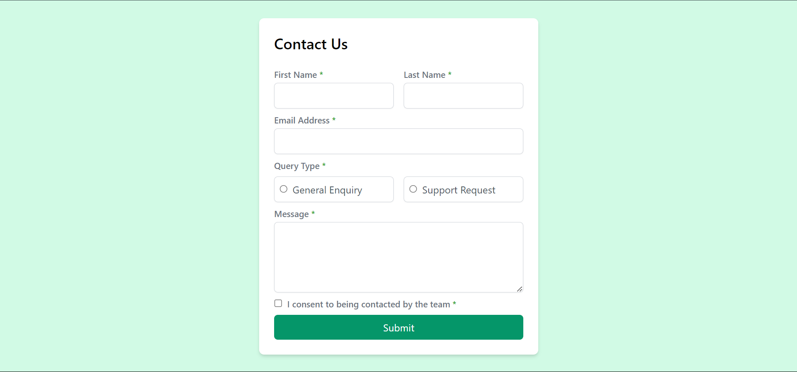

# Frontend Mentor - Contact form solution

This is a solution to the [Contact form challenge on Frontend Mentor](https://www.frontendmentor.io/challenges/contact-form--G-hYlqKJj). Frontend Mentor challenges help you improve your coding skills by building realistic projects. 

## Table of contents

- [Overview](#overview)
  - [The challenge](#the-challenge)
  - [Screenshot](#screenshot)
- [My process](#my-process)
  - [Built with](#built-with)
  - [What I learned](#what-i-learned)
  - [Continued development](#continued-development)
  - [Useful resources](#useful-resources)
- [Author](#author)
- [Acknowledgments](#acknowledgments)

## Overview

### The challenge

Users should be able to:

- Complete the form and see a success toast message upon successful submission
- Receive form validation messages if:
  - A required field has been missed
  - The email address is not formatted correctly
- Complete the form only using their keyboard
- Have inputs, error messages, and the success message announced on their screen reader
- View the optimal layout for the interface depending on their device's screen size
- See hover and focus states for all interactive elements on the page

### Screenshot

## My process

### Built with

- Semantic HTML5 markup
- CSS custom properties
- Tailwind CSS
- Mobile-first workflow

### What I learned

- In this project, I improved my understanding of Tailwind CSS for creating responsive and aesthetically pleasing form components. 
- I also gained experience in form validation and styling interactive elements.

### Continued development

- In future projects, I aim to enhance my skills in form handling, validation, and integrating JavaScript for more interactive and dynamic forms. 
- Additionally, I want to explore more advanced features of Tailwind CSS.

### Useful resources

- Tailwind CSS Documentation (https://tailwindcss.com/docs/installation) - This helped me understand how to use utility-first CSS classes effectively.

## Author

- Website - [Frontend Mentor | Contact form](http://127.0.0.1:5500/contact-form-main/index.html)
- Frontend Mentor - [@PhoEniX1704](https://www.frontendmentor.io/profile/PhoEniX1704)

## Acknowledgments

Thanks to the Frontend Mentor community for the continuous support and feedback.
